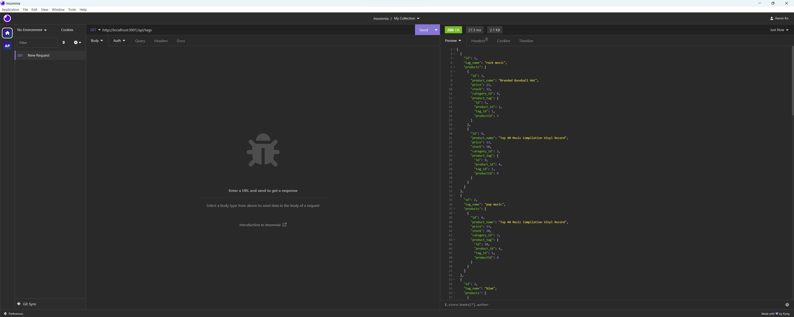

# E-Commerce-Backend
The challenge is to build the back end for an e-commerce site.

## Table Of Content
* [Description](#description)
* [Installation](#installation)
* [Demonstration](#demonstration)
* [Contact](#contact)

## Description

This challenge is to build the back end for an e-commerce site. You’ll take a working Express.js API and configure it to use Sequelize to interact with a MySQL database.

## Installation

Install dependencies 
```terminal
npm i
``` 
Open up MySQL shell and input 
```terminal
source db/schema.sql
```

Then quit MySQL shell and input the following in your terminal
```terminal
npm run seed
```
To start running application simply input 
```terminal
node server.js
```

## Demonstration



[Full Walkthrough  Video](https://drive.google.com/file/d/1fHEy9jEWpSaNY1GSbyoMoSpyWRkzAIZX/view)

## Contact

If you have any additonal questions or would like to provide any feedback, feel free to reach me at:

[Github](https://github.com/aaronmko)